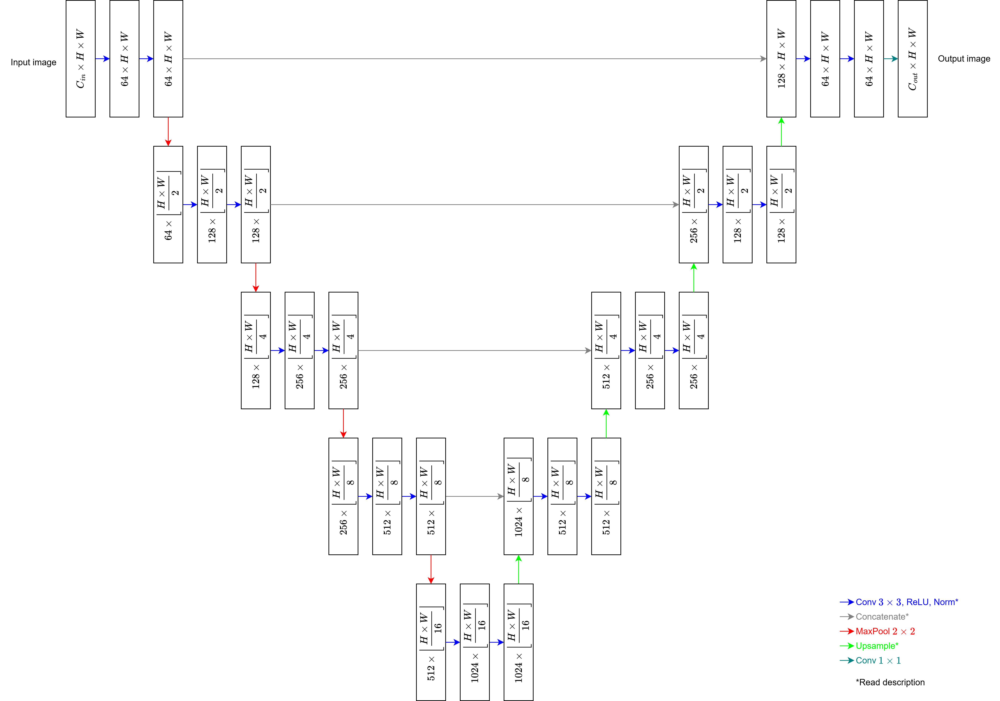

# U-Net
This repository contains an implementation of U-Net [[1]](#references). [unet.py](https://github.com/sm00thix/unet/blob/main/unet.py) implements the class UNet. The implementation has been tested with PyTorch 2.7.1 and CUDA 12.6.

If you use the code shared in this repository, please cite this work: https://arxiv.org/abs/2504.14131. The U-Net implementation in this repository was used to generate pixel-wise fat predictions in an image of a pork belly.

## Options
The UNet class provides two options for upsampling:
1. bilinear = False: Transposed convolution with a 2x2 kernel applied with stride 2.
2. bilinear = True: Bilinear upsampling followed by convolution with a 1x1 kernel applied with stride 1.
Regardless of the choice of upsampling, the number of convolution (or transposed convolution) filters (output channels) are equal to half the number of input channels.

There are also options for padding.
1. pad = True: The input size is retained in the output by zero-padding convolutions and, if necessary, the results of the upsampling operations.
2. pad = False: The output is smaller than the input as in the original implementation. In this case, every 3x3 convolution layer reduces the height and width by 2 pixels each. Consequently, the right side of the U-Net has a smaller spatial size than the left size. Therefore, before concatenating, the central slice of the left tensor is cropped along the spatial dimensions to match those of the right tensor.

Finally, there are options for adding a normalization layer after the non-linearity (ReLU), which follows each convolution and transposed convolution.
1. normalization = None: Applies no normalization.
2. normalization = "bn": Applies batch normalization [[2]](#references).
3. normalization = "ln": Applies layer normalization [[3]](#references). A permutation of dimensions is performed before the layer to ensure normalization is applied over the channel dimension. Afterward, the dimensions are permuted back to their original order.

In particular, setting bilinear = False, pad = False, and normalization = None will yield the U-Net as originally designed. Generally, however, bilinear = True is recommended to avoid checkerboard artifacts.

## References

1. [O. Ronneberger, P. Fischer, and Thomas Brox (2015). U-Net: Convolutional Networks for Biomedical Image Segmentation. *MICCAI 2015*.](https://arxiv.org/abs/1505.04597)
2. [S. Ioffe and C. Szegedy (2015). Batch Normalization: Accelerating Deep Network Training by Reducing Internal Covariate Shift. *ICML 2015*.](https://arxiv.org/abs/1502.03167)
3. [J. L. Ba and J. R. Kiros and G. E. Hinton (2016). Layer Normalization.](https://arxiv.org/abs/1607.06450)

## Funding
This work has been carried out as part of an industrial Ph. D. project receiving funding from [FOSS Analytical A/S](https://www.fossanalytics.com/) and [The Innovation Fund Denmark](https://innovationsfonden.dk/en). Grant number 1044-00108B.